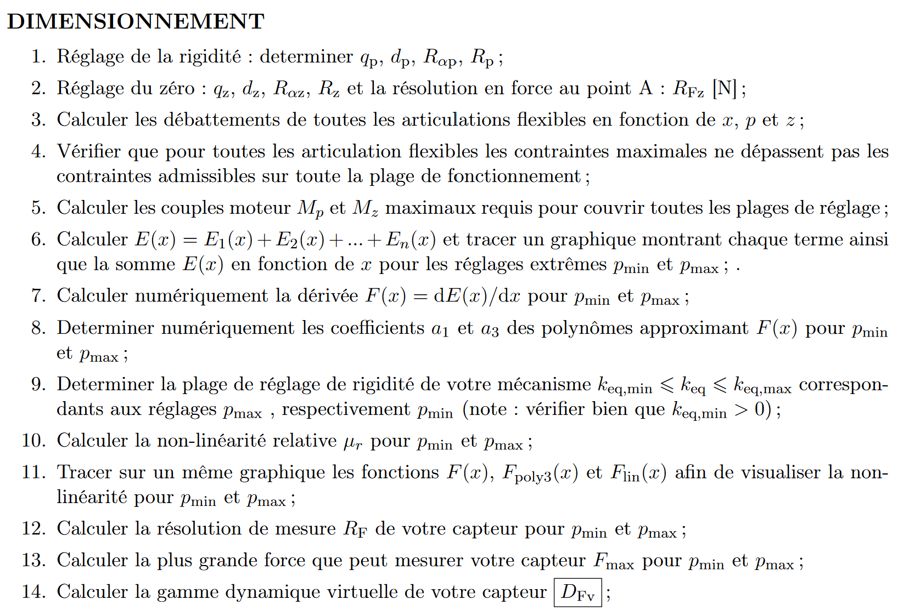

# FlexProbeOptimisation

find the right geometrical parameters for each blade and necked joint
so that the total ridity can be as close to zero as possible.

2 pivot RCC angulaire
1 table à lame
2 pivot à col
1 lame rigidité négative

# Pivot RCC

# pivot à col

