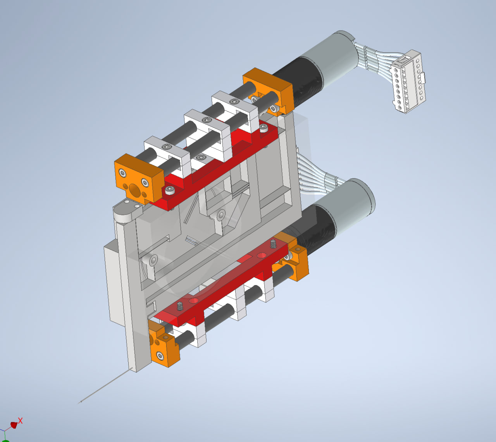

# FlexProbeOptimisation
this repo contain code to compute and properties
of an adjustable stiffness force sensor and optimise
it's parameter to get the best resolution possible

after running the code, report.md is updated with the result
