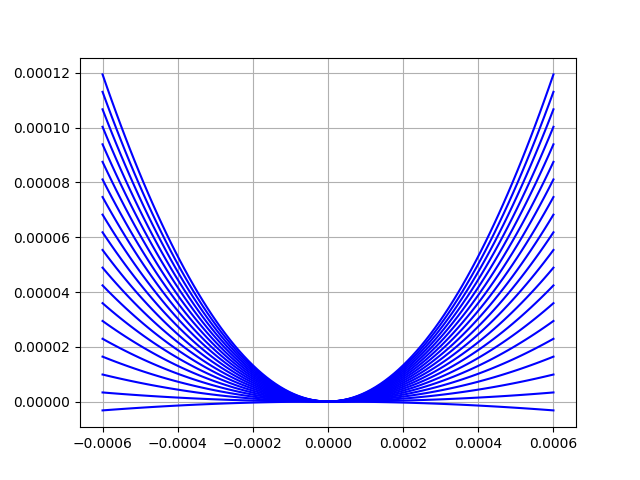

# Paramètre utiliser pour le calcul des résultat

# 2 Principe de fonctionnement

## 2.6)
Mise en évidence des concepts originaux et explications spécifiques à la solution retenue

# 3) Dimmensionnement

## 3.0 Intro
Target :
Plage de mesure : Fmax > 50 mN

Résolution de mesure : RF < 500 nN. Il s’agit du principal critère d’optimisation du capteur
qui consiste à minimiser la valeur RF(keq,min)

Correction du zéro : le système de réglage doit permettre de corriger des forces parasites
selon l’axe X dans l’intervalle suivant : −1 mN <= Fparasite <= 1 mN

## 3.1 rigidité 
meme actionneur utilisé pour les deux fonction :
q_p = 0.05 mm / tour (vis différentiel : 0.5 mm et 0.45 mm )
d_p = M2.5 et M3
R_alphap = 1.6° (backlash du reducteur) sinon 0.024245°=360/(512 code/tour * 29 (réducteur))
R_p = 0.003367 micron (q_p/(512*29 (reducteur))) ou 0.22222 micron (backlash)
plage de p max = 0-1mm

## 3.2 réglage du zéro
meme actionneur utilisé pour les deux fonction :
q_z = 0.05 mm / tour (vis différentiel : 0.5 mm et 0.45 mm )
d_z = M2.5 et M3
R_alphaz = 1.6° (backlash du reducteur) sinon 0.024245°=360/(512 code/tour * 29 (réducteur))
R_z = 0.003367 micron (q_p/(512*29 (reducteur))) ou 0.22222 micron (backlash)
plage de z max = 0-1mm

résolution point A : Rfz
Plage de réglage demandé : -1mF à 1mF
nombre de position possible du moteur = 4'500
Rfz = deltaFparasite / nombre de position possible du moteur = 2mN/4500= 4.444*10^{-7}[N]

## 3.3 débattement des articulation
(formule mouvement relatif)
0.5 mm sur toute les lames
(légerement moins sur la roue est nécéssaire mais simplifier aussi à 0.5 mm)

## 3.4 contrainte max flamage + casse chaque lame

## 3.5 Couple moteur
Nominal torque (max. continuous torque) = 3.33 mNm
réducteur ratio = 29
Nominal Torque on shaft = 29*3.33 mNm = 96.57 mNm
(we neglect loss and add a 20% safety margin at the end)
radius = M3-> 3.2mm/2=1.6mm (on prend le plus gros diametre des 2)
force max = ominal Torque/radius = 60.35 N
donc on se limite à 50 Newton par sécurité
( et  on vois par la suite que la force de précontrainte est inférieur dans tout les cas)

## 3.6 Energie de chaque systeme + total 
Energie de chaque systeme + total pour le réglage de force max et min sur toute la plage de x

(échelle en unité SI, Joule par metre (avec une précharge N pour chaque courbe))
attention. la force de précontrainte est calculer est calculer par lame.
pour avoir la valeurs total il faut multiplier par le nombre de lame qui transmettent la force

## 3.7 dérivé energie = Force en fonction de X

(échelle en unité SI, N/m par N)
attention. la force de précontrainte est calculer est calculer par lame.
pour avoir la valeurs total il faut multiplier par le nombre de lame qui transmettent la force
## 3.8  polynome Force en fonction de x degrée 2 (a0 a1 a2)

F (x) ∼= Fpoly3(x) = a0 + a1 · x + a2 · x2 + a3 · x3 ;

## 3.9 k_eq min et k_eq max (dérivé encore)

## 3.10 non-linéarité relative mu pour p min et max

## 3.11 combiner F(x), F_poly3(x) et F_lin(x) sur le meme graph

## 3.12 Rp résolution a pmin et p_max
RF(keq,min) : résolution du capteur de force avec son réglage le moins rigide

## 3.13 Force Max mesurable à p_min et p_max
avec Fmax ∼= keq · smax

## 3.14 gamme dynamique virtuelle (nombre de point ) de la Force mesurable
(Force MAX / Force min)

DFv : gamme dynamique virtuelle du capteur de force : DFv = Fmax(keq,max)/RF(keq,min)

(échelle en unité SI, N/m par N)
attention. la force de précontrainte est calculer est calculer par lame.
pour avoir la valeurs total il faut multiplier par le nombre de lame qui transmettent la force

Kmin = 0.001 N/m max mais resolution moteur limite pas à 0.02222 N/m (22 fois plus)
1'000 m/N max  -> 45.000000000 m/N

500 micro
10 nm -> 50'000 point de mesure

résolution max = 0.05 nano Newton -> 0.22 nano Newton... (2'272 fois mieux que demander)

force max = Fmax > 50 mN
500 micron * Kmax = F_max
Kmax = 100 N/m

résolution moteur = 1.6°/360°*50 micron
plage dynamic moteur = 1000 micron*360° /(1.6°*50 micron) = 4'500 pts over 1 mm

100 N/m -> F_1 = 2.9N
0 N/m -> F_0 = ~ 3.3N / lame -> *3 pour total
course 1 mm, delta = 0.4N*3=1.2N -> k=1'200N/m (1'166 réel #Goodenough)

# 3) Fpoly3(x) [N] : Caractéristique force-déformation approximée par un polynôme de degrés trois :

# 4) μ_r : Non-linéarité relative : μr = a3/a1

# 5) k [N/m] : Rigidité à l’entrée du capteur de force : k = a1 ∼= F/x

# 6) F_lin(x) [N] : Caractéristique force-déformation linéarisée : F (x) ∼= Flin(x) = k · x

# 7) s(x) [m] : Déplacement de la cible du capteur de position induit par le déplacement x

# 8) keq [N/m] : Rigidité équivalente du corps d’épreuve : keq ∼= F/s = k · x/s = k · i. Remarque : une
fois keq connue, la force appliquée est déterminée via la relation F ∼= keq · s

# 9) S [m/N] : Sensibilité du capteur de force : S = 1/keq

# 10) RF [N] : Résolution du capteur de force : RF = keq · Rs = k1 · i · Rs

# 11) Fmax [N] : Etendue de la plage de mesure du capteur de force : Fmax 50mN

# 12) DF : Gamme dynamique du capteur de force : DF = Fmax/RF

# 5 Construction

## 5.1) choix de construction

## 5.2) Matériaux

aliage titane-6Al-4V

tres peu magnétique
compatible avec le vide, dégaze peu
110 GPa

