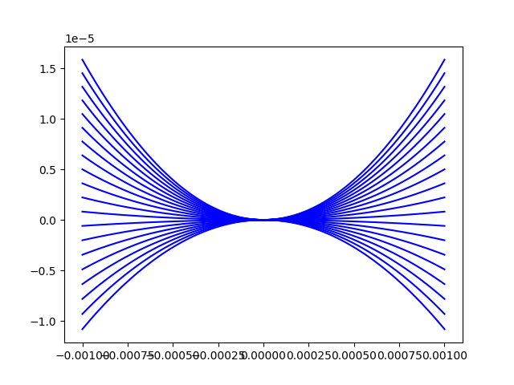
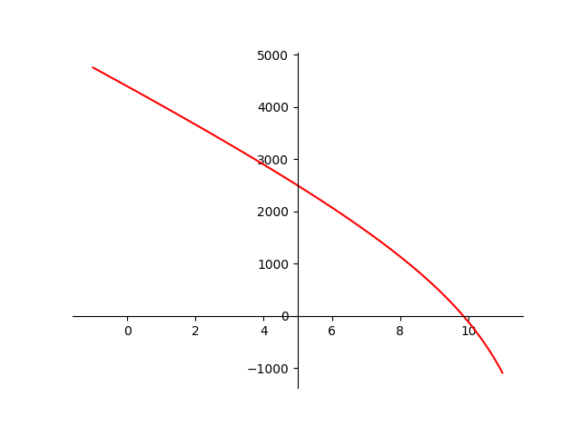

# Paramètre utiliser pour le calcul des résultat

# 1) Energie en fonction de la position et différente pré contrainte

(échelle en unité SI, Joule par metre (avec une précharge N pour chaque courbe))
# 2) rigidité équivalente en fonction de la précontrainte

(échelle en unité SI, N/m par N)
# 3) Fpoly3(x) [N] : Caractéristique force-déformation approximée par un polynôme de degrés trois :
F (x) ∼= Fpoly3(x) = a0 + a1 · x + a2 · x2 + a3 · x3 ;

# 4) μ_r : Non-linéarité relative : μr = a3/a1

# 5) k [N/m] : Rigidité à l’entrée du capteur de force : k = a1 ∼= F/x

# 6) F_lin(x) [N] : Caractéristique force-déformation linéarisée : F (x) ∼= Flin(x) = k · x

# 7) s(x) [m] : Déplacement de la cible du capteur de position induit par le déplacement x

# 8) keq [N/m] : Rigidité équivalente du corps d’épreuve : keq ∼= F/s = k · x/s = k · i. Remarque : une
fois keq connue, la force appliquée est déterminée via la relation F ∼= keq · s

# 9) S [m/N] : Sensibilité du capteur de force : S = 1/keq

# 10) RF [N] : Résolution du capteur de force : RF = keq · Rs = k1 · i · Rs

# 11) Fmax [N] : Etendue de la plage de mesure du capteur de force : Fmax 50mN
avec Fmax ∼= keq · smax

# 12) DF : Gamme dynamique du capteur de force : DF = Fmax/RF

Avec les valeurs extrêmes du réglage de précharge pmin et pmax nous définissions respectivement :

keq,max et keq,min : bornes de la plage de réglage de rigidité ;

fmin et fmax : fréquences propres du corps d’épreuve

Fmax(keq,max) : plus grande force que peut mesurer le capteur avec son réglage le plus rigide ;

RF(keq,min) : résolution du capteur de force avec son réglage le moins rigide

DFv : gamme dynamique virtuelle du capteur de force : DFv = Fmax(keq,max)/RF(keq,min)

Target :
Plage de mesure : Fmax > 50 mN

Résolution de mesure : RF < 500 nN. Il s’agit du principal critère d’optimisation du capteur
qui consiste à minimiser la valeur RF(keq,min)

Correction du zéro : le système de réglage doit permettre de corriger des forces parasites
selon l’axe X dans l’intervalle suivant : −1 mN <= Fparasite <= 1 mN
