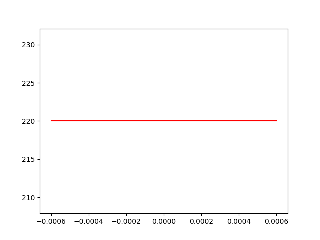
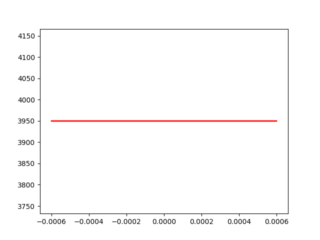
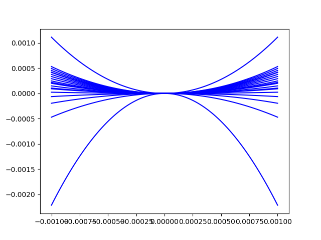
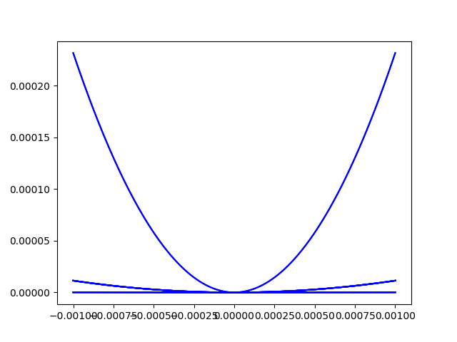
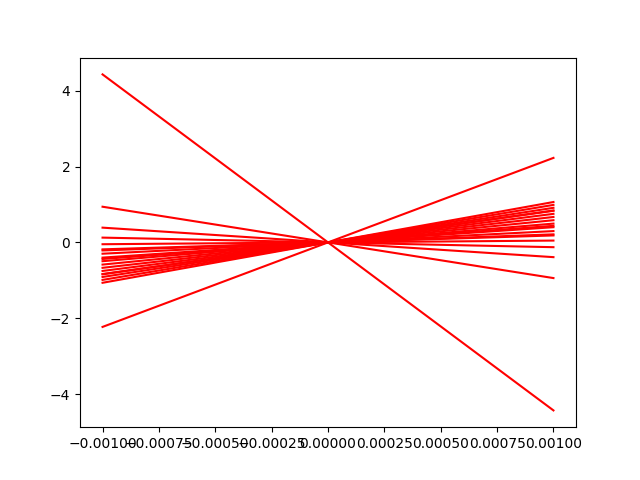
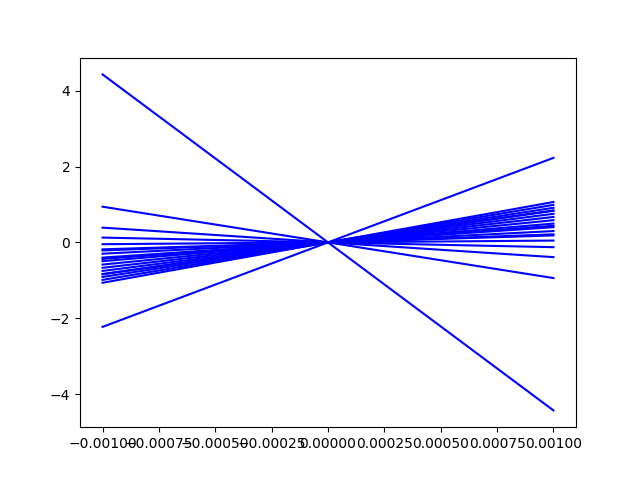
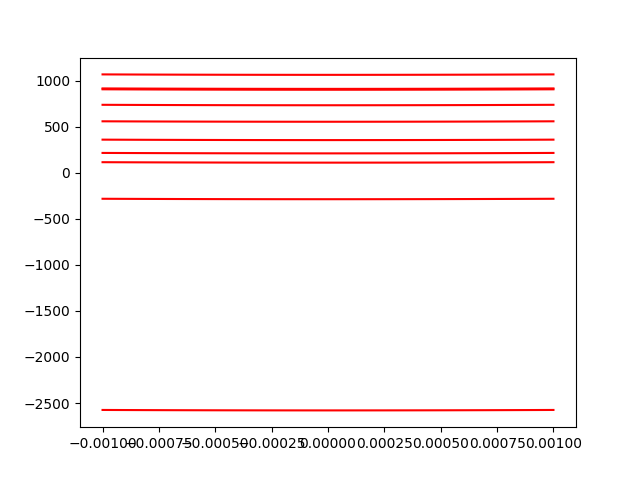

# Paramètre utiliser pour le calcul des résultat

modele de demonstration.
goal = plage du poid d'une plume (10 uN)
MDF 5mm

# 2 Principe de fonctionnement

## 2.6)
Mise en évidence des concepts originaux et explications spécifiques à la solution retenue

# 3) Dimmensionnement

## 3.0 Intro
Target :
Plage de mesure : Fmax > 50 mN

Résolution de mesure : RF < 500 nN. Il s’agit du principal critère d’optimisation du capteur
qui consiste à minimiser la valeur RF(keq,min)

Correction du zéro : le système de réglage doit permettre de corriger des forces parasites
selon l’axe X dans l’intervalle suivant : −1 mN <= Fparasite <= 1 mN

nous allons dabord dimmensionné le système de correction du zéro 
car sa rigidité doit êre prise en compte dans la rigidité total du système.

## 3.1 réglage du zéro
meme actionneur utilisé pour les deux fonction :
q_z = 0.05 mm / tour (vis différentiel : 0.5 mm et 0.45 mm )
d_z = M2.5 et M3
R_alphaz = 1.6° (backlash du reducteur) sinon 0.024245°=360/(512 code/tour * 29 (réducteur))
R_z = 0.003367 micron (q_p/(512*29 (reducteur))) ou 0.22222 micron (backlash)
plage de z max = 0-1mm

résolution point A : Rfz
Plage de réglage demandé : -1mF à 1mF
nombre de position possible du moteur = 4'500
Rfz = deltaFparasite / nombre de position possible du moteur = 2mN/4500= 4.444*10^{-7}[N]

dans le but de diminuer l'impacte de la rigidité de la table sur le reste du systeme,
nous avons utiliser la roue pour diminué la course rensentie par la table
à lame d'un facteur 8. en échange il nous à fallu fournir 8 fois plus de force
donc pas +-1mN mais +-8mN
rigidité des lames : (2 lames*ratio transformation de 8 -> 16 N/m par lame)

nous avons donc essayer de tuner les parametre de notre table pour obtenir la rigidité total de 16 N/m:
avec une table à 2 lamme  mais la longeur devenais trop grande.

Nous avons donc du faire une table avec la plus grande 
hauteur possible : 20 mm de long, 8mm de largeur et 100 um d'épaisseur
nous avons obtenu 220 N/m.

soit une plage de réglage de entre -110mN et 110mN
avec une résolution de 0.04888 mN

## 3.2 rigidité 
meme actionneur utilisé pour les deux fonction :
q_p = 0.05 mm / tour (vis différentiel : 0.5 mm et 0.45 mm )
d_p = M2.5 et M3
R_alphap = 1.6° (backlash du reducteur) sinon 0.024245°=360/(512 code/tour * 29 (réducteur))
R_p = 0.003367 micron (q_p/(512*29 (reducteur))) ou 0.22222 micron (backlash)
plage de p max = 0-1mm

pour déterminer la force que le pusher doit appliquer on graphe le k_eq du system
jusqua trouver les bonnes forces
on aimerais que nos rigidité sois entre : 50 N/m et 

pour la borne minimal on veux une résolution 500 nN
mais la résoltion du cateur est de 10 micron
ce qui nous donne une rigidité à 0.05 N/m ou mieux (0 N/m)

 (rigidité (N/m) en fonction de la position)
on peut voir que les parametre qui rentre bien dans le range sont :
2.53 N au minimum
2.63 N au maximum
Ces valeurs représente la force à appliquer par lamme.
comme il y as 3 lamme  en parralel, il faut en réalité 
forceMin = 2.53*3=7.59 N
forceMax = 2.63*3=7.89 N
si on voulais maximiser la résoltion il faudrait que le
0.3 N de force revienne à une course d'un 1mm de la table à lamme.
hors cela impliquerais une déformation de 26 mm latérallement.

hors pour des raison géométrique, il est difficile d'avoir une tel course.

nous choississont donc limiter la course de notre table à 2 mm 
de plus nous allons précontraidre la table de 1mm à l'assemblage 
pour profiter de la précharge et supprimer le jeux sur l'actionneur
en plus de profiter d'une meilleure résolution de la force de précharge
dans la région d'interet.

cela impose à notre table d'avoir une rigidité de 7.89N/0.002m=3'945 N/m
et nous pourrons ainsi obtenir une résolution de rigidité.
pour se faire on utilise le nombre de position distincte que l'axe linéaire
peut prendre (4500) répartis sur la plage d'un 1mm ce qui nous donne
3.945 N / 4500 point = 0.8766 mN de résolution pour la force de précharge

de plus on vois qu'on est largement en dessous de la force maximal que 
peut tollérer l'actionneur linéaire.

on voit sur le graphique que la table a lame à bien la rigidité de 3945 N/m
attendu.

## 3.3 débattement des articulation
(formule mouvement relatif)
0.5 mm sur toute les lames
(légerement plus sur la roue est nécéssaire mais simplifier à 1 mm)

## 3.4 contrainte max flamage + casse chaque lame
(vérifier que les lame supporte une déformation de 2-3mm (demander TRISTAN))

## 3.5 Couple moteur
Nominal torque (max. continuous torque) = 3.33 mNm
réducteur ratio = 29
Nominal Torque on shaft = 29*3.33 mNm = 96.57 mNm
(we neglect loss and add a 20% safety margin at the end)
radius = M3-> 3.2mm/2=1.6mm (on prend le plus gros diametre des 2)
force max = ominal Torque/radius = 60.35 N
donc on se limite à 50 Newton par sécurité
( et  on vois par la suite que la force de précontrainte est inférieur dans tout les cas)

## 3.6 Energie de chaque systeme + total 

Energie total pour le réglage de force sur toute la plage de x
(échelle en unité SI, Joule par metre (avec une précharge N pour chaque courbe))
attention. la force de précontrainte est calculer est calculer par lame.
pour avoir la valeurs total il faut multiplier par le nombre de lame qui transmettent la force
et la au point de rigidité minimum avec un graph pour chaque élément

Energie de chaque systeme + 

## 3.7 dérivé energie = Force en fonction de X

(échelle en unité SI, N/m par N)
attention. la force de précontrainte est calculer est calculer par lame.
pour avoir la valeurs total il faut multiplier par le nombre de lame qui transmettent la force
## 3.8  polynome Force en fonction de x degrée 2 (a0 a1 a2)

F (x) ∼= Fpoly3(x) = a0 + a1 · x + a2 · x2 + a3 · x3 ;

## 3.9 k_eq min et k_eq max (dérivé encore)
Determiner la plage de réglage de rigidité de votre mécanisme keq,min 6 keq 6 keq,max correspon-
dants aux réglages pmax , respectivement pmin (note : vérifier bien que keq,min > 0) 

## 3.10 non-linéarité relative mu pour p min et max

mu_r=0

## 3.12 résolution

( chaque ligne montre un réglage de résolution)
ce graphe montre la résolution a 4 point conséqutif de réglable de la précontrainte)
dans le pire des cas on as une rigidité :
RigidityPmin=0.2 N/m

RigidityFPmax=2.5N/m

RFminpmin = 2 nF
RFminpmax = 25 nF

mais dans le meilleures des cas elle peut etre encore meilleure

## 3.13 Force Max mesurable à p_min et p_max
avec Fmax ∼= keq · smax

Fmax_p_min=0.000006810 N (6.8 uN)

Fmax_p_max=0.3405 N

## 3.14 gamme dynamique virtuelle (nombre de point ) de la Force mesurable
(Force MAX / Force min)

DFv : gamme dynamique virtuelle du capteur de force : DFv = Fmax(keq,max)/RF(keq,min)

(échelle en unité SI, N/m par N)
attention. la force de précontrainte est calculer est calculer par lame.
pour avoir la valeurs total il faut multiplier par le nombre de lame qui transmettent la force

DFv=0.3405 N/2 nF=170'250'000

# 5 Construction

## 5.1) choix de construction

## 5.2) Matériaux

aliage titane-6Al-4V

tres peu magnétique
compatible avec le vide, dégaze peu
110 GPa

